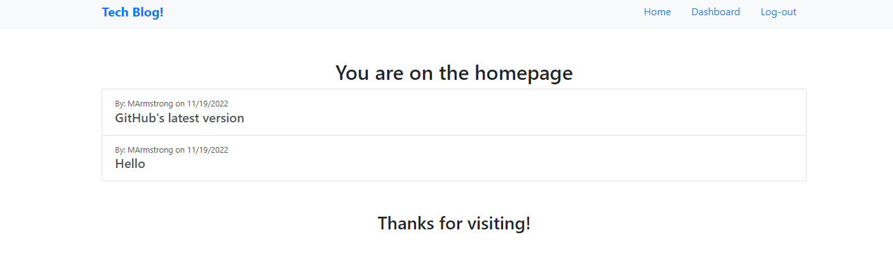
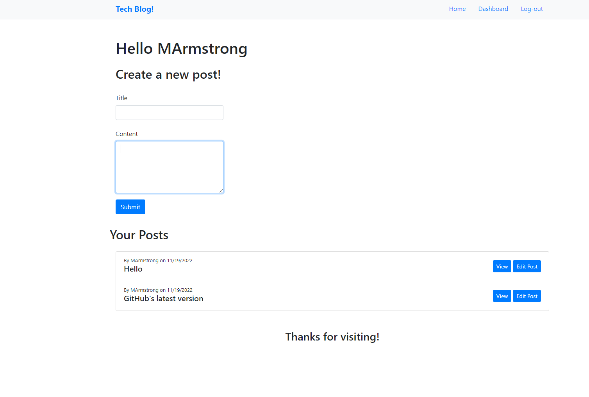
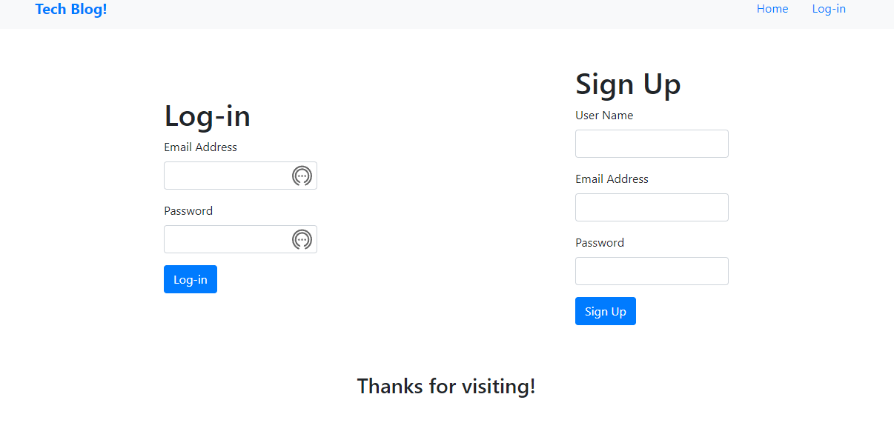

# Tech Blog

## About the Project
This application was created to be a blog for tech news. This is a site where users can signup to be able to post about anything tech related and also comment on others' posts. The homepage displays all of the recent posts that other users and yourself have posted. When using this site for the first time make sure you signup and create an account for yourself and then navigate back to the homepage and view all posts and/or navigate to your dashboard to create a post of your own.

## Built With:

### Front End:

### Back End:

### Server:

## Here's a link to the Heroku Deployment
https://guarded-beach-97718.herokuapp.com/

## Here's a preview of the application
#### HomePage

#### Dashboard

#### Signup / Login

## Contribution:
Made by Mitchell Armstrong

## Contact
Mitchell Armstrong - mra0211@gmail.com